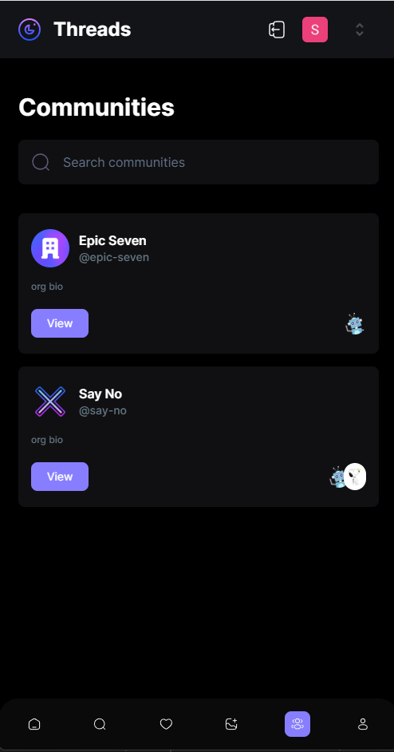

# Threads - Clone

> Inspired by Twitter, now X, and Threads, social media platforms became a must have communication tool to connect and reach out to a global audience. Using Next.js 13 and its powerful server/client rendering capabilities allows faster renders and seamlessly incorporates that technology into our components. Authentication is not a pain anymore with Clerk. Clerk handles social logins and username/password, along with webhooks that listen to real-time events and much much more.

> Live website [_here_](https://threads-app-flax.vercel.app/).
>
> Inspired by JavaScript Mastery [_here_](https://www.youtube.com/watch?v=O5cmLDVTgAs).

## Table of Contents

- [General Info](#general-information)
- [Technologies Used](#technologies-used)
- [Features](#features)
- [Screenshots](#screenshots)
- [Setup](#setup)
- [Project Status](#project-status)

## General Information

- This Threads-Clone is a sleek social media app that loads quickly, looks fantastic, and keeps your data safe. It's made with Next.js for fast pages, MongoDB for smart data handling, and TailwindCSS for beautiful designs. Stay updated in real-time with webhooks, and trust Clerk for secure logins. With robust architecture and Zod for data validation, it's the smart choice for social networking. You can post threads and share your voice with others.

## Technologies Used

- nextjs - 13.4.19
- tailwindcss - version 3.3.3
- react - version 18.2.0
- typescript - 5.2.2
- @clerk/nextjs - 4.23.4
- @radix-ui
- @uploadthing/react - 5.5.0
- zod - 3.22.2
- mongoose - 7.5.0

## Features

- User login and Authentication with Clerk
- Create threads and communities
- Search up users or communities
- Display activity when others respond to threads
- Threads, profiles, communities are saved with MongoDB

## Screenshots

## Setup

`cd to correct folder`

`npm install`

`npm run dev`

## Project Status

Project is: _in progress_

## Room for Improvement

To do:

- Implement Like feature on threads
- Implement Repost feature on threads
- Implement Share feature on threads
- Add functionality for Replies and Tagged on profile page
